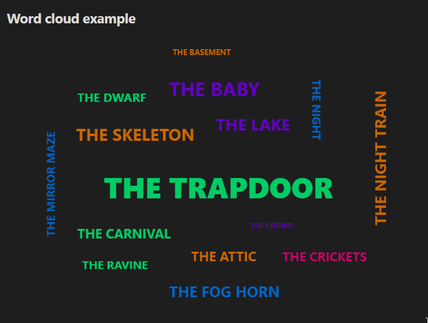
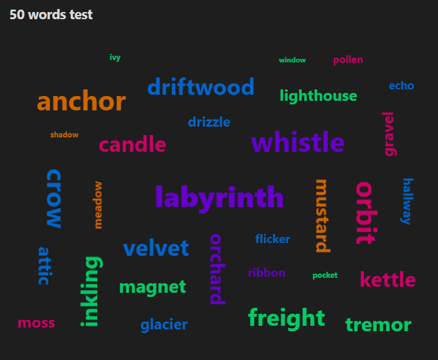
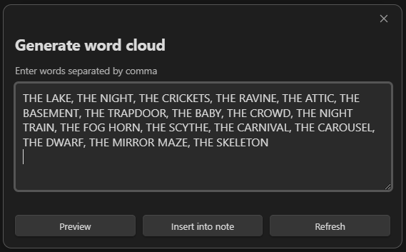
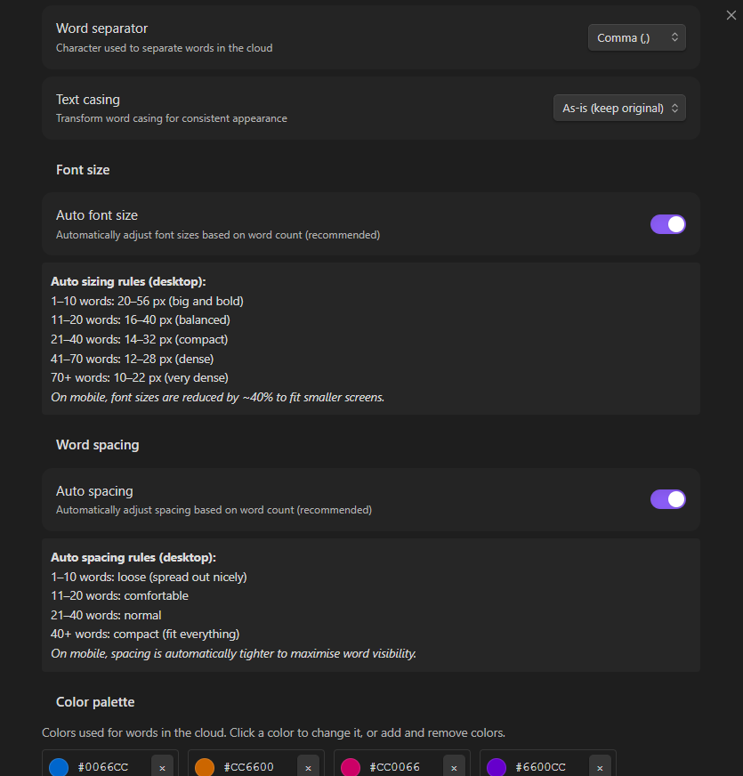
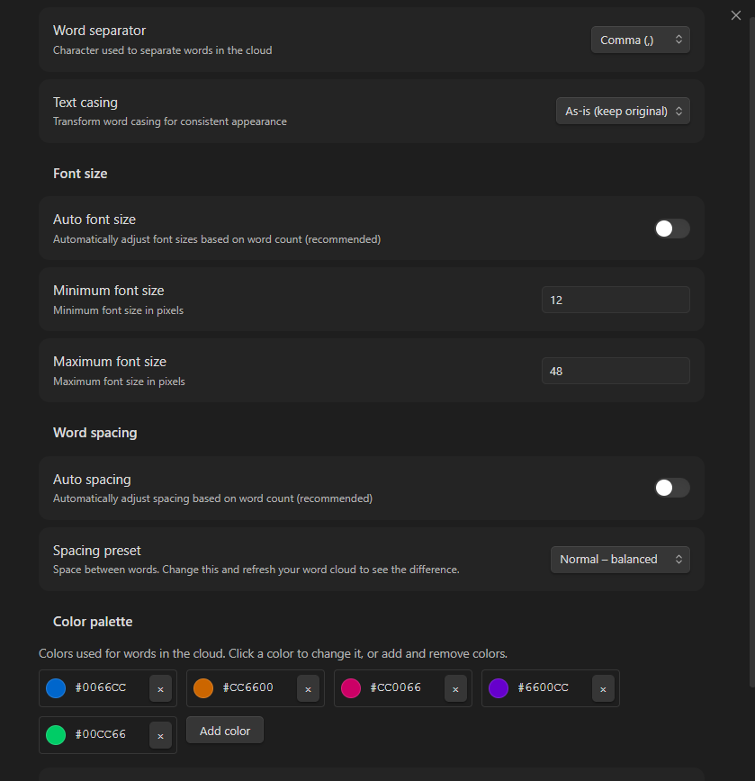

# Word cloud

Create beautiful, interactive word clouds in Obsidian with random sizes, colors, and orientations. Click on an word to center it and watch the cloud regenerate!

## Inspiration

This plugin was inspired by Ray Bradbury's essay in *Zen in the Art of Writing*, where he describes his creative process of making lists of evocative nouns:

> THE LAKE. THE NIGHT. THE CRICKETS. THE RAVINE. THE ATTIC. THE BASEMENT. THE TRAPDOOR...

Bradbury would write these lists, then pick a word and let it guide him into stories. The words became "provocations" that helped him discover honest, hidden ideas buried in his subconscious.

This plugin brings that technique to Obsidian - visualize your ideas, themes, or concepts as a word cloud, click on any word that calls to you, and let it center your thinking. Just as Bradbury's lists led him to discover patterns and connections, your word clouds can help you see relationships between ideas and spark new creative directions.

Whether you're brainstorming story ideas, organizing research themes, or exploring conceptual connections, Word Cloud turns your lists into an interactive space for discovery.

## Demo



## Features

- **Dynamic visualization** - Words displayed in random colors, sizes, and orientations
- **Interactive** - Click any word to center it and redistribute others around it
- **Smart auto-scaling** - Automatically adjusts font sizes and spacing based on word count
- **Mobile-friendly** - Works seamlessly on both desktop and mobile devices
- **Highly customizable** - Control colors, fonts, spacing, separators, and text casing
- **Intelligent placement** - Advanced spiral algorithm ensures all words fit without overlap



## Installation

Plugin is submitted and waiting for approval, but you can try it:

### Manual installation
1. Download the latest release from [GitHub releases](https://github.com/jetrica/obsidian-word-cloud/releases)
2. Extract the files to `<vault>/.obsidian/plugins/word-cloud/`
3. Reload Obsidian
4. Enable the plugin in Settings → Community Plugins

### Beta installation (BRAT)
1. Install the [BRAT plugin](https://github.com/TfTHacker/obsidian42-brat)
2. Add beta repository: `https://github.com/jetrica/obsidian-word-cloud`
3. BRAT will auto-update when new versions are released

## Usage

### Creating a word cloud

#### Method 1: Command palette
1. Open Command Palette (`Ctrl/Cmd + P`)
2. Search for "Insert cloud"
3. Enter your words in the modal
4. Click "Preview" to see it live
5. Click "Insert into note" to add it to your document



#### Method 2: Code block
Simply create a code block with the `wordcloud` language:

````markdown
```wordcloud
innovation, creativity, design, technology, teamwork, leadership, vision, strategy, growth, success
```
````

### Using different separators

The plugin respects your separator setting (comma by default):

**Comma-separated:**
```wordcloud
apple, banana, orange, grape
```

**Space-separated:** (after changing separator in settings)
```wordcloud
apple banana orange grape
```

**Period-separated:**
```wordcloud
apple. banana. orange. grape
```

## Settings

Access settings via: **Settings → Word Cloud**

### Settings screen



### Settings with "auto" options turned off




### Word separator
Choose how words are separated in your input:
- **Comma (,)** - Default, most common
- **Period (.)** - For sentences or special formats
- **Space ( )** - For simple word lists
- **Semicolon (;)** - For lists with commas in items
- **Pipe (|)** - For technical data

**Example:**
```wordcloud
AI | Machine Learning | Deep Learning | Neural Networks
```

---

### Text casing
Transform word casing for consistent appearance:

- **As-is (keep original)** - Respects your input exactly *(default)*
- **Uppercase** - ALL WORDS IN CAPITALS
- **Lowercase** - all words in lowercase
- **Title case** - Each Word Capitalized

**Examples:**

Input: `innovation, CREATIVITY, design, TEAMWORK`

| Setting | Output |
|---------|--------|
| As-is | innovation, CREATIVITY, design, TEAMWORK |
| Uppercase | INNOVATION, CREATIVITY, DESIGN, TEAMWORK |
| Lowercase | innovation, creativity, design, teamwork |
| Title case | Innovation, Creativity, Design, Teamwork |

**Smart title case:**
- Single words: Simply capitalized (e.g., "innovation" → "Innovation")
- Multi-word phrases: Proper title case with smart handling of small words
  - Example: "the art of design" → "The Art of Design"
  - Small words kept lowercase: a, an, and, as, at, but, by, for, in, of, on, or, the, to, with
  - First and last words always capitalized

---

### Font size

#### Auto font size (recommended) 
Automatically adjusts font sizes based on word count:

| Word count | Font range | Best for |
|------------|------------|----------|
| 1-10 words | 20-56px | Big & bold for small lists |
| 11-20 words | 16-40px | Balanced, general use |
| 21-40 words | 14-32px | Compact word clouds |
| 41-70 words | 12-28px | Dense clouds |
| 70+ words | 10-22px | Very dense clouds with many words |

**Toggle off** to set manual font sizes.

#### Manual font size
When auto mode is disabled, you can set:
- **Minimum font size** (default: 12px) - Smallest words
- **Maximum font size** (default: 48px) - Largest words

Words are randomly assigned sizes between min and max.

---

### Word spacing

#### Auto spacing (recommended) 
Automatically adjusts spacing based on word count:

| Word count | Spacing | Effect |
|------------|---------|--------|
| 1-10 words | Loose | Spread out nicely, lots of breathing room |
| 11-20 words | Comfortable | Balanced spacing |
| 21-40 words | Normal | Efficient use of space |
| 40+ words | Compact | Fits everything, minimal gaps |

**Toggle off** to choose manual spacing preset.

#### Manual spacing presets
When auto mode is disabled, choose from:

- **Compact** - Very tight spacing, maximum word density
- **Normal** - Balanced spacing for general use
- **Comfortable** - Loose spacing, easier to read
- **Loose** - Very loose spacing, minimalist aesthetic

---

### Color palette
Customize the colors used for words in the cloud.

**Default palette:** Blue, Orange, Pink, Purple, Green

**To customize:**
1. Click on any color to change it (color picker opens)
2. Click **"+ Add color"** to add more colors (up to 10 recommended)
3. Click **"×"** to remove a color (minimum 1 required)
4. Click **"Reset to defaults"** to restore original colors

**Tips:**
- Use 3-5 colors for cohesive clouds
- Use 7-10 colors for variety in large clouds
- Match your vault's theme colors
- Use complementary colors for visual harmony

**Color ideas:**
- **Professional:** Blues and grays
- **Vibrant:** Rainbow spectrum
- **Monochrome:** Different shades of one color
- **Seasonal:** Warm colors (fall), cool colors (winter)
- **Brand:** Your company/project colors

---

## Tips & tricks

### Best practices

**Word Count:**
- **5-15 words** - Great for key concepts, themes, or tags
- **20-40 words** - Ideal for brainstorming, project keywords
- **50+ words** - Text analysis, comprehensive overviews

**Use cases:**
- **Meeting notes** - Key takeaways as word cloud
- **Project planning** - Core concepts visualization
- **Tag clouds** - Visualize your most-used tags
- **Content analysis** - Extract main themes from text
- **Creative writing** - Character traits, setting elements
- **Study notes** - Key terms for quick review

### Performance

- **Up to 100 words** - Smooth performance
- **100-200 words** - May take a few seconds to render
- **200+ words** - Not recommended (some words may not fit)

### Refreshing the cloud

Each time you:
- Open the note
- Reload Obsidian
- Click "Refresh" in the modal

The cloud regenerates with **different random positions, sizes, and rotations** while keeping the same color palette and settings.

If you click/tap on one of the cloud words, cloud will refresh with selected word focused in the center.

### Mobile usage

The plugin is fully optimized for mobile:
- **Tap** any word to center it
- Touch feedback with visual scaling
- Responsive sizing for small screens
- Works in both portrait and landscape

**Access on mobile:**
- Command palette → "Insert cloud"
- No ribbon icon (Obsidian mobile limitation)

## Examples

### Simple tag cloud
```wordcloud
productivity, knowledge-management, pkm, zettelkasten, writing, research, notes
```

### Project keywords
```wordcloud
agile, sprint, retrospective, backlog, user-stories, velocity, stand-up, kanban, scrum, deployment
```

### Book themes
```wordcloud
love, betrayal, redemption, sacrifice, courage, destiny, hope, darkness, journey, transformation
```

### Character traits
```wordcloud
brave, intelligent, stubborn, loyal, mysterious, charismatic, conflicted, ambitious, compassionate
```

### Research topics
```wordcloud
machine-learning, neural-networks, deep-learning, AI, algorithms, data-science, NLP, computer-vision
```

## Customization examples

### Professional dark theme
Settings:
- Colors: #2563eb, #64748b, #94a3b8
- Casing: Title case
- Auto sizing: ON
- Auto spacing: ON

### Vibrant rainbow
Settings:
- Colors: #ef4444, #f59e0b, #10b981, #3b82f6, #8b5cf6, #ec4899
- Casing: Uppercase
- Spacing: Loose

### Minimalist monochrome
Settings:
- Colors: #1f2937, #4b5563, #6b7280, #9ca3af
- Casing: Lowercase
- Spacing: Comfortable

## Troubleshooting

### Plugin won't enable
- Ensure you're running Obsidian 0.15.0 or higher
- Check that `isDesktopOnly` is set to `false` in manifest.json
- Try disabling other plugins to check for conflicts
- Restart Obsidian completely

### Words not appearing
- **Too many words** - Try with fewer words (under 100)
- **Font sizes too large** - Reduce max font size or enable auto sizing
- **Spacing too tight** - Increase spacing or enable auto spacing

### Mobile issues
- Update to latest Obsidian mobile version
- Clear app cache (Settings → About → Clear cache)
- Reinstall the plugin

### Flickering on hover (Desktop)
- This is fixed in v1.0.0+
- Update to latest version if experiencing this

## License

MIT License - see [LICENSE](LICENSE) file for details.

